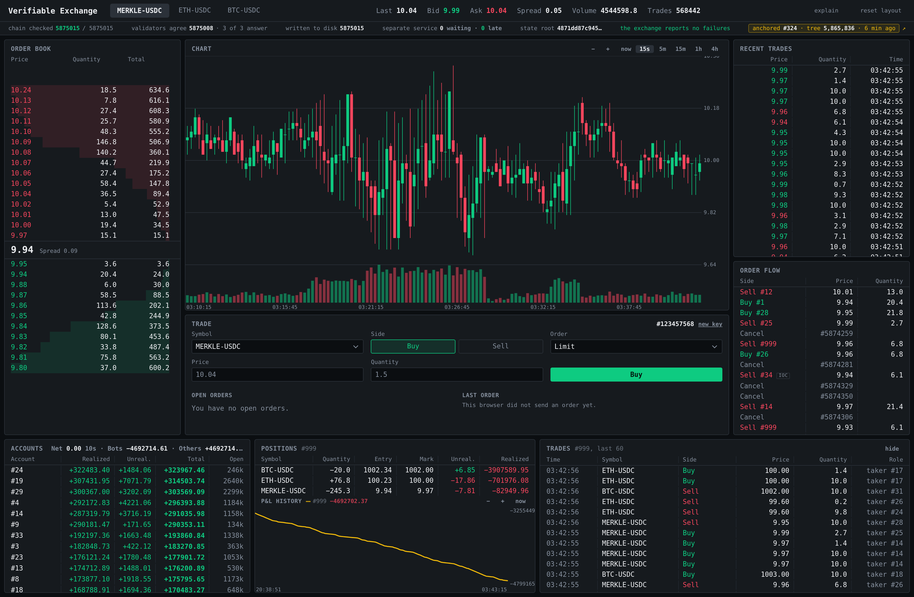

# Verifiable Exchange

A limit-order matching engine with a signed, append-only order log. The
sequencer (`services/src/feed.rs`) puts every message in one order and signs the
list. The exchange (`services/src/matcher.rs`) replays those messages and
matches orders by price, then by time.

This is a public research deployment with synthetic markets. It does not hold
funds or settle trades. Base Sepolia records a Merkle root every five minutes.

**Anyone can verify what this exchange did from one URL.** The
exchange signs what each batch of messages produced. The verifier fetches those
claims, runs the same messages again, and compares the results. No database
access or operator account is required.

**Public demo.** The Trade panel at
[exchange.th3nolo.com](https://exchange.th3nolo.com) creates a session-only
Ed25519 key and takes an order.
It saves the raw demo key in unencrypted `localStorage` only if you choose
**remember key**. You install nothing.



The strip along the top is the subject of this project. An order book looks the
same whether the operator is honest or not, and nothing else on that screen
tells you which one you are looking at. The strip reports how far the signed
chain hash is checked, how far the validators agree, the current state root,
and whether any check has ever failed.

## Architecture

- The Rust sequencer orders submissions, stores their original bytes in
  SQLite, and signs an RFC 9162 Merkle tree head.
- The Rust matcher applies deterministic price-time priority and publishes a
  signed state root for each batch.
- Three validators implement the matching rules separately and compare their
  results with the matcher.
- A Go sender writes the verified Merkle root to a Solidity contract on Base
  Sepolia. The browser reads it back through public RPC endpoints.

## Run it

```bash
./demo.sh
```

Seven programs: the sequencer, the separate service it does not control, the
exchange, three validators and a bot. The UI is at <http://127.0.0.1:3001>.
Ctrl-C stops everything. It all lands in `run/`, deleted and recreated on each
start.

## Check it yourself

Run the whole history again from the sequencer's own messages, and compare:

```
$ services/target/release/services --audit-url https://exchange.th3nolo.com

  PASS  every claim is signed by this run's key      311 checked
  PASS  the messages are the ones the run consumed     1 checked
  PASS  the claims cover everything the run committed  1 checked
  PASS  claims form an unbroken chain of roots        621 checked
  PASS  re-executed state roots match the claims      312 checked
  PASS  claimed trade counts match the re-execution   312 checked
  PASS  recorded trades match the re-execution       1125 checked
```

That takes **a URL and nothing else**. No database file, no node, no access to
the operator's machine.

To check one trade instead of the whole history, ask for its inclusion proof.
The log is a Merkle tree built to RFC 9162, so the proof is the hashes on one
path and not the messages beside it:

```bash
curl -s 'https://feed.exchange.th3nolo.com/proof/inclusion?leaf=122363&tree_size=245223'
```

**18 hashes. 576 bytes**, measured on 17 August 2026 at tree size 245,223.
`ceil(log2(245,223))` is 18, so that path is the shortest the tree allows. The
anchor sender writes that root to Base Sepolia every five minutes
([`0x4162B321…672d`](https://sepolia.basescan.org/address/0x4162B3218b97663dEBC1f59060910221bb95672d)),
so the proof ends at a value the operator cannot revise afterwards.

Or break it. Edit one row of the sequencer's database and restart it:

```bash
sqlite3 run/feed.db "UPDATE feed_messages SET json = json_replace(json, '$.New.price', 999.99) WHERE id = 1"
services/target/release/services --start-feed
```

The sequencer exits 2, prints the two chain values that disagree, and changes
nothing. An earlier version rewrote its own stored chain to match the edit and
then signed the result. That is the failure this check exists to prevent.

## What is built, and what is not

Three of the five layers are complete: state on disk, a signed hash-chained
log, and a separate service the sequencer does not control. The fourth gives
the safety half of agreed ordering and not the liveness half, so if the
sequencer stops, the market stops. The fifth is not wrapped in a zero-knowledge
proof, which was measured and rejected rather than skipped.

## What's in here

- [`services/ROADMAP.md`](services/ROADMAP.md): the design story in order,
  what each layer does not give you, and why there is no zkVM.
- [`docs/DECISIONS.md`](docs/DECISIONS.md): every decision, what it was chosen
  over, what it costs, and how it behaves at scale.
- [`docs/ENGINE.md`](docs/ENGINE.md): the specification every program obeys.
- [`docs/API.md`](docs/API.md): every command, flag and HTTP endpoint, and how
  to sign a submission.

Also: [`docs/GLOSSARY.md`](docs/GLOSSARY.md) (one name per thing),
[`docs/WRITING.md`](docs/WRITING.md), [`docs/BOT.md`](docs/BOT.md) and
[`docs/GENERATOR-RFC.md`](docs/GENERATOR-RFC.md) (the two programs that make
the traffic), [`anchor/README.md`](anchor/README.md) (the contracts on Base),
and [`services/README.md`](services/README.md) (running one service alone).

Security reports belong in a private GitHub advisory, not a public issue. See
[`SECURITY.md`](SECURITY.md) for the reporting scope and the details that make a
report reproducible.

## How this was built

I built this with AI under my direction and review. This project argues that
you should not have to trust a statement you cannot check, so I state that
plainly rather than let you assume otherwise.

The design decisions are mine, including the decisions to *not* build
something. The performance numbers in this README are measurements. Each part
went through adversarial review, and I pinned the findings with regression
tests. Two independent architecture reviews concluded that two subsystems did
not earn their place, so I removed 2,614 lines. This started as a one-hour
take-home exercise, and I extended it well past the original scope on my own
time.
